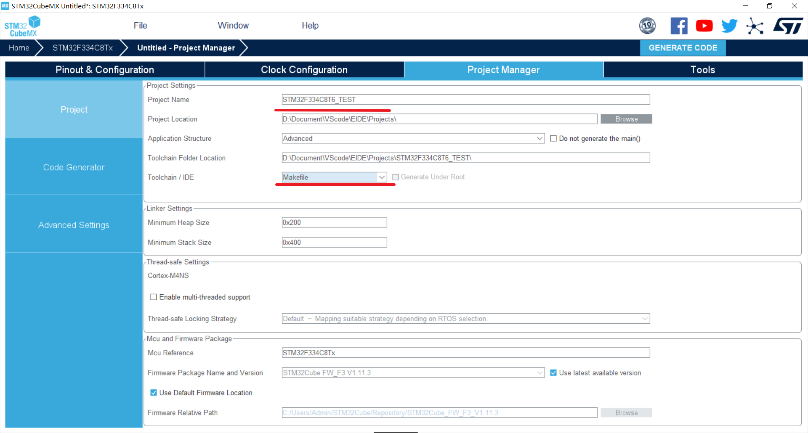
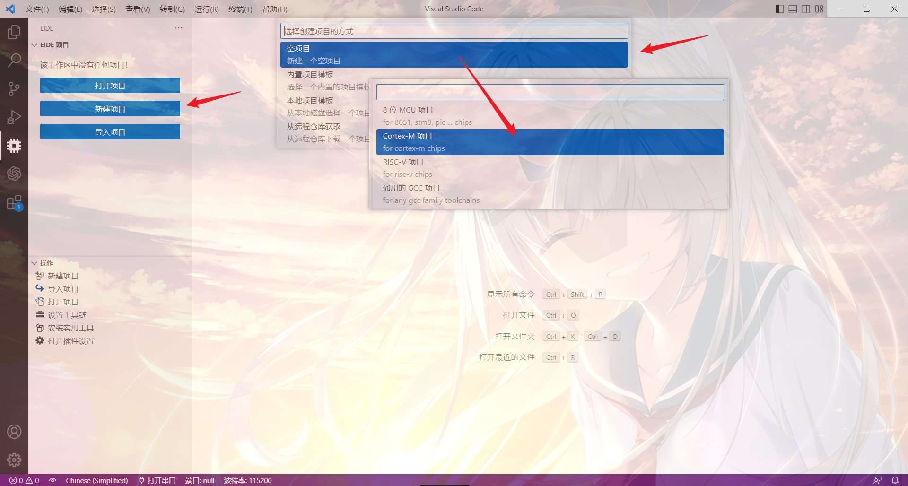
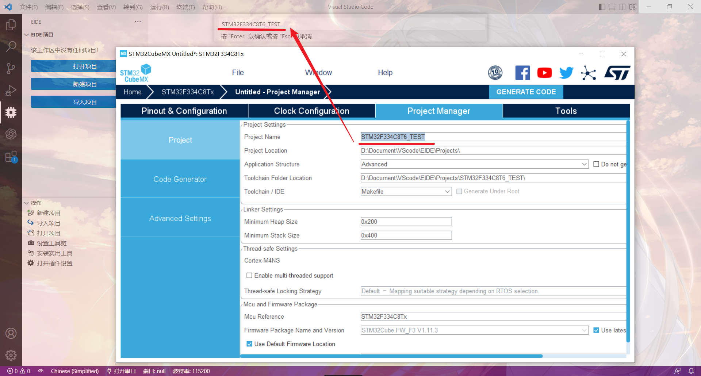
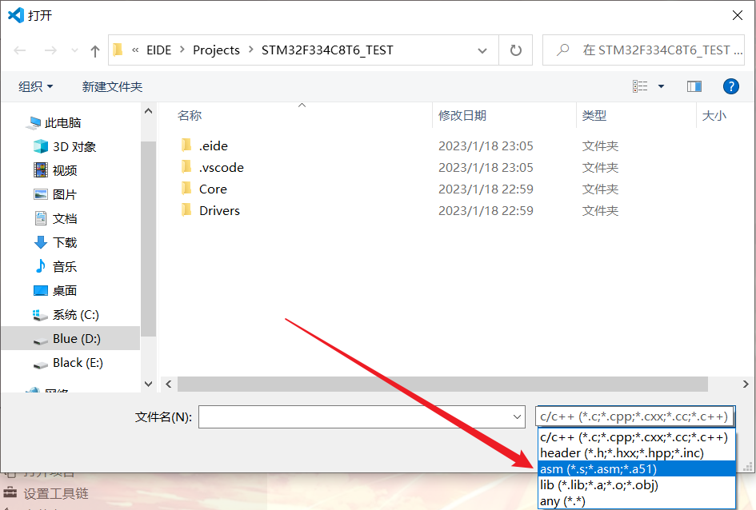
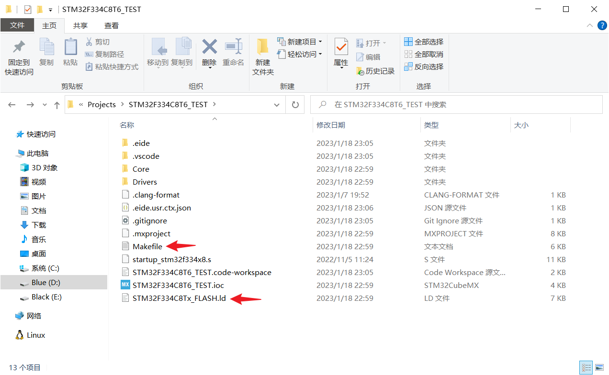
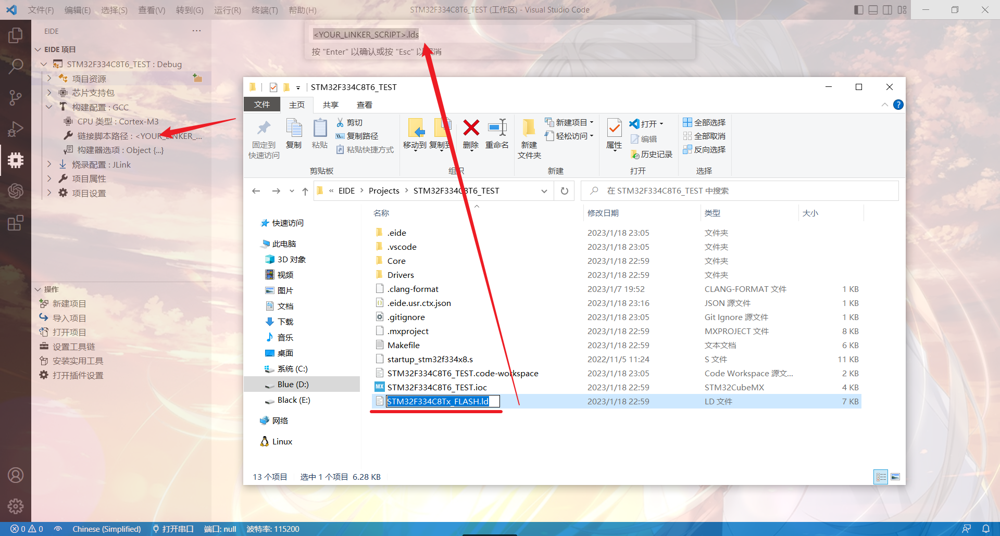
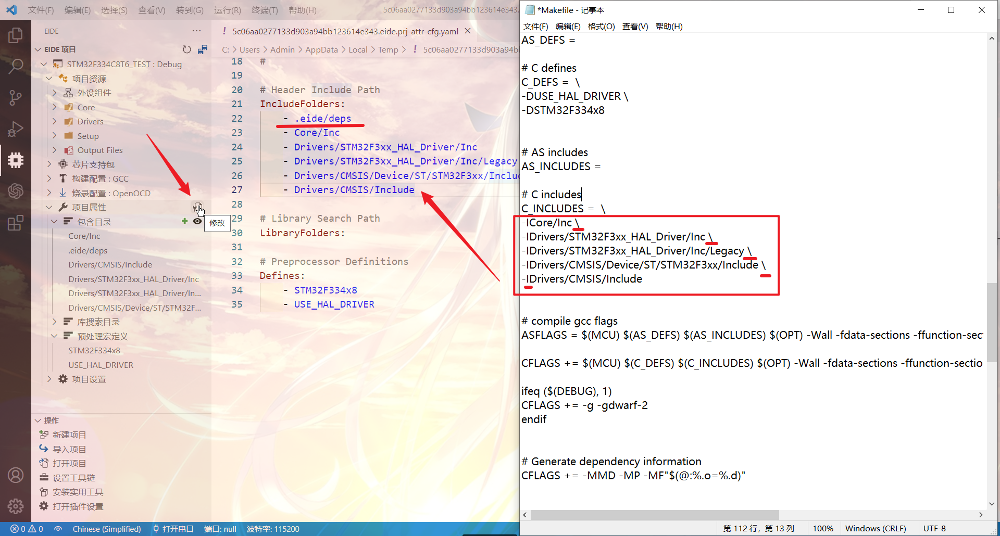
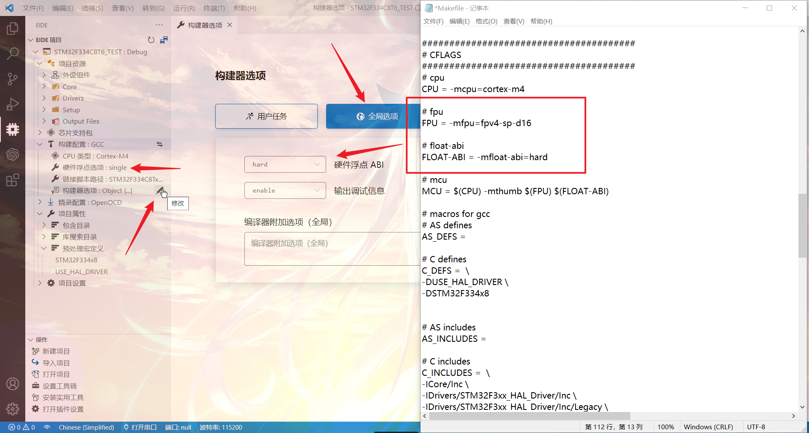
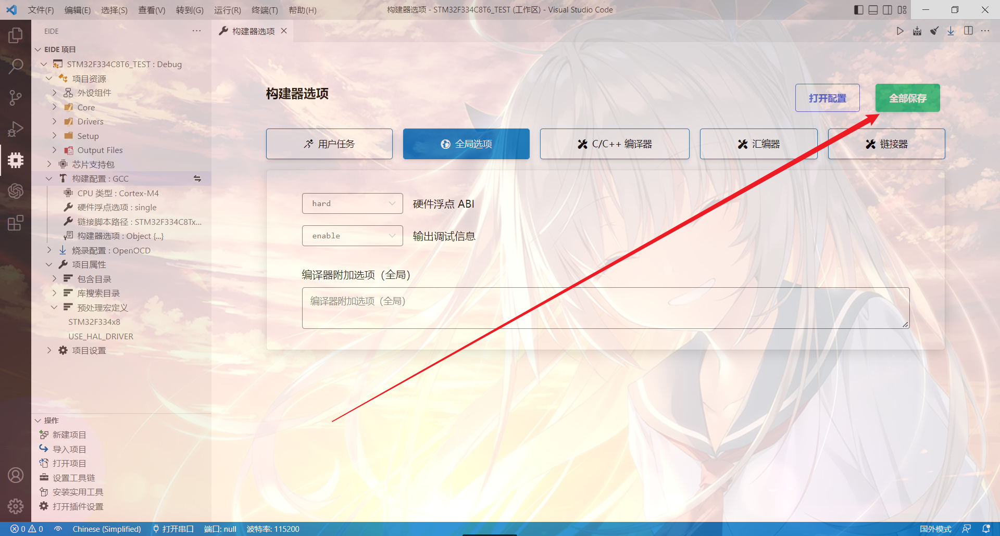
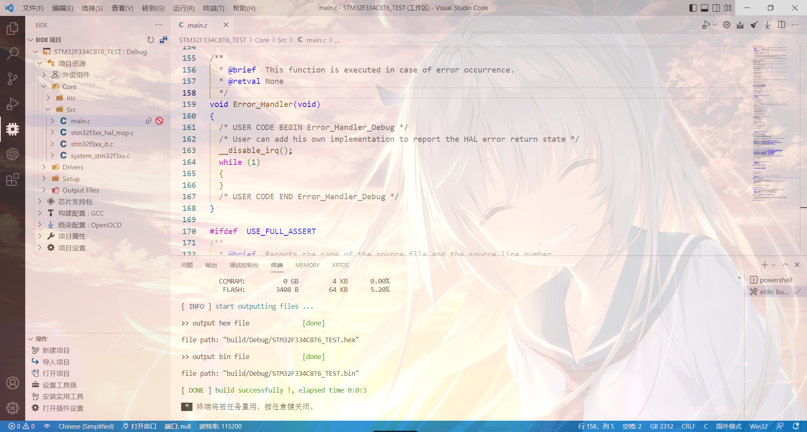

浅谈使用VSCode+EIDE+CubeMX开发STM32 HAL库
====

> 对于我这种大懒狗，在学会用CubeMX对STM32进行HAL库的配置之后，才知道CubeMX在代码配置方面简直完爆标准库的手写配置o(*￣▽￣*)ブ。突然觉得当初不听学长的话，去学标准库的我就是个大聪明/(ㄒoㄒ)/~~。

以下是我本次项目的相关配置:  
单片机：STM32F334C8T6  
构建器配置：GCC  
库文件：HAL库

其他的配置对本次教程没有影响，其中EIDE的基础配置我就不在这里多讲了，我在上一篇开发标准库的专栏里面有介绍。  

# 1.CubeMX生成代码配置

这一步需要注意的是，**不要使用中文路径以及中文项目名称** ；以及在Toolchian / IDE选项选择 **Makefile** 。  

# 2.新建EIDE工程并添加相关文件  
新建一个空的Cotrex-M项目。

为项目命名，需要注意的是，EIDE的项目名称必须要和刚刚CubeMX生成的工程**名称一致**（CV）
  

EIDE项目路径选择，这一步也需要选择和CubeMX生成代码的工程一样的路径。请确保你在打开CubeMX生成的工程所在路径的文件夹时，可以看到你使用CubeMX生成的工程名称一样的文件夹（我这里为STM32F334C8T6_TEST）。不要选中，保证弹窗底下文件夹对话框为工程路径末尾文件夹的名称（我这里为Projects）。

确认之后，VSCode右下角会有一个弹窗提示项目文件夹已存在，说明上一步没有问题，我们要将EIDE的项目跟Cube的工程建立在同一个文件夹内。选择Yes。

添加必要的项目文件，使用普通文件夹添加 **Core** 和 **Drivers** 两个文件夹。

> 这里可以添加任意目录下的文件，如果你的习惯是库文件与工程文件分开放，就很适合使用这种方式。

添加一个虚拟文件夹用来存放.s启动文件。

注意需要将文件类型修改为 asm 才会出现 .s 文件。

> 也可以直接将s放在根目录，不建立虚拟文件夹。

# 3.根据Makefile文件对项目进行相应的配置

> 虽然EIDE需要用CubeMX生成的是makefile文件，但是EIDE并不会读取这个文件，本文使用makefile文件仅是作为配置参考。

打开项目文件夹，下面我们要用到的是 **Makefile** 文件和 **xxx_FLASH.ld** 文件。

修改构建配置为 **GCC** ，将链接脚本路径改为 **xxx_FALSH.ld** 文件，直接将文件名（包括后缀）一起复制粘贴即可。

使用记事本打开Makefile文件，将CPU类型和预处理宏定义配置好。在填写预处理宏定义的时候，需要将开头的 **-D** 和末尾的 **\*** 去掉。

最后是对包含路径（IncludePath）和对象文件（ObjectFiles）的配置，有自动检索和手动添加两种方式。自动检索在3.8.3版本就改为了默认关闭，详见[EIDE论坛问答](https://discuss.em-ide.com/d/356/2)

虽然新项目是默认关闭自动检索，但是我们也可以手动打开。进入资源管理器，打开工作区，打开
**.code-workspace**
文件 ，添加方框内的两句函数，将参数改为true保存即可，**需要重启VSCode才能生效**。

**需要注意的是，EIDE的自动检索功能只会检索上一节中已经添加到\[资源目录\]下的文件夹中的所有子文件**

手动添加会花一点时间，但是这个习惯也和keil差不多，不过EIDE只需要添加包含目录，没有keil那么繁琐？（我几乎没用过keil，不太了解，只记得配置标准库的时候把我整吐了≧ ﹏ ≦）。

直接对项目属性的配置文件进行修改会比一条一条添加方便一点，在Makefile中找到# C includes后接着的这些语句，将框内的部分添加到 IncludeFolders: 下，画红线的是EIDE默认的包含目录，不要去动它。复制进去删掉每一句开头 - 后面的 I 以及末尾的 \ （画横线的部分）。

> 仔细观察可以发现，需要手动添加的文件目录均为头文件 **.h** 的文件目录

补充：关于包含路径（IncludePath）和对象文件（ObjectFiles）的配置，在EIDE拓展的设置中，有两个选项如下图：

这两个选项的就是作者在3.8.3版本关闭的自动检索功能，我们把他√上，插件在编译工程的时候就会自己去检索包含路径（IncludePath）和对象文件（ObjectFiles）了。不过在新建工程的时候 . code-workspace 文件里面不会添加 "EIDE.SourceTree.AutoSearchIncludePath" 和 "EIDE.SourceTree.AutoSearchObjFile" 这两句函数，当然此时插件已经默认开启了这个功能，也省了我们每次新建工程都要自己添加这两句函数。

# 选做：开启硬件浮点加速

硬件浮点选项选择single，构建器选项的全局选项中float ABI选择hard。

修改完构建器选项别忘记右上角保存。

  
全局编译一次过，完美！

# 与MDK工程共存
这个可能是CubeMX生成代码工程的一个特性？我试着在CubeMX上改为输出MDK工程但是他并没有对文件结构产生太大的影响，VSCode仍然可以同步修改以及编译（深入的功能我还没有学那么多，不知道在哪些地方不兼容）。这也是一个好处，就是身边的小伙伴都在用keil的时候，你需要跟他们共享工程就可以直接丢给他了(●'◡'●)。

可以看到，文件夹中仅仅多出了一个MDK-ARM文件夹。

> 如果在先前的文件中使用了非CubeMX生成的库文件，请手动在keil中添加相关路径。

这边同样也是编译成功。

